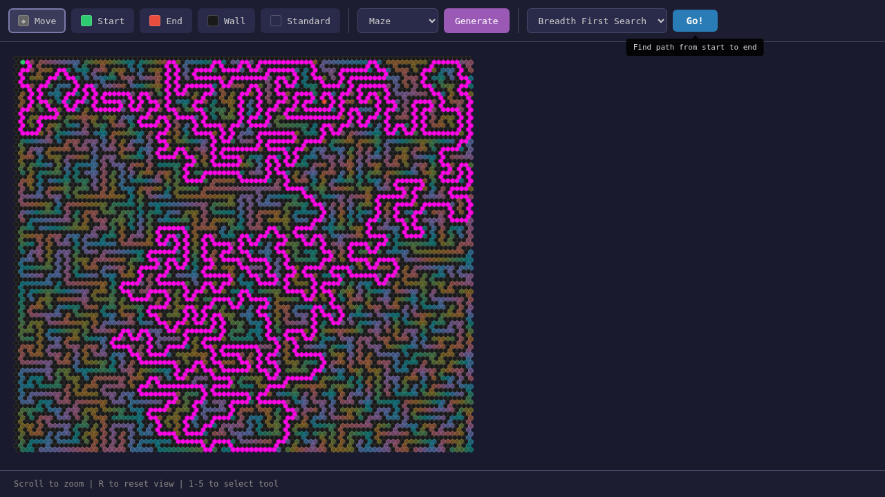

# Hexham

> ⚠️🤖🤮 More or less 100% vibe coded - this project is primarily here for me to learn about Claude Code.

A hexagonal grid pathfinding visualizer. Watch BFS, DFS, A\*, and Greedy Best-First search algorithms explore mazes in real-time.



## Usage

Open `index.html` in a browser. No build step required.

## Development

```bash
npm install
npx tsc         # type check
npm test        # run Playwright tests
```
